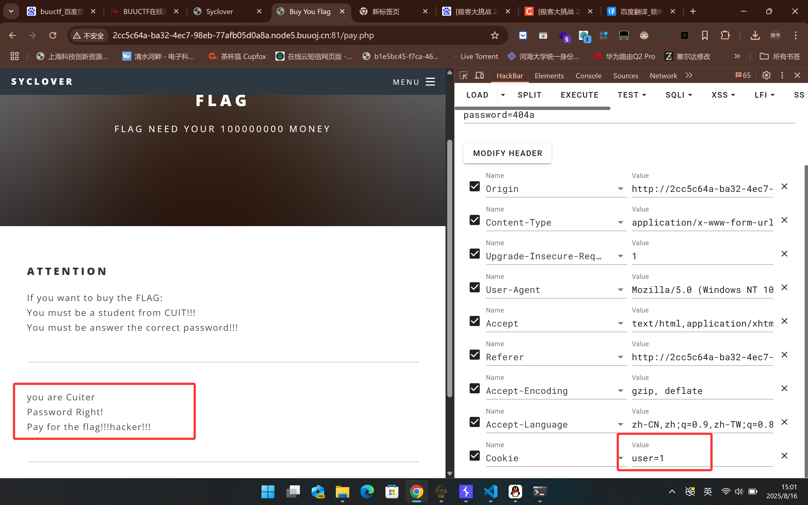
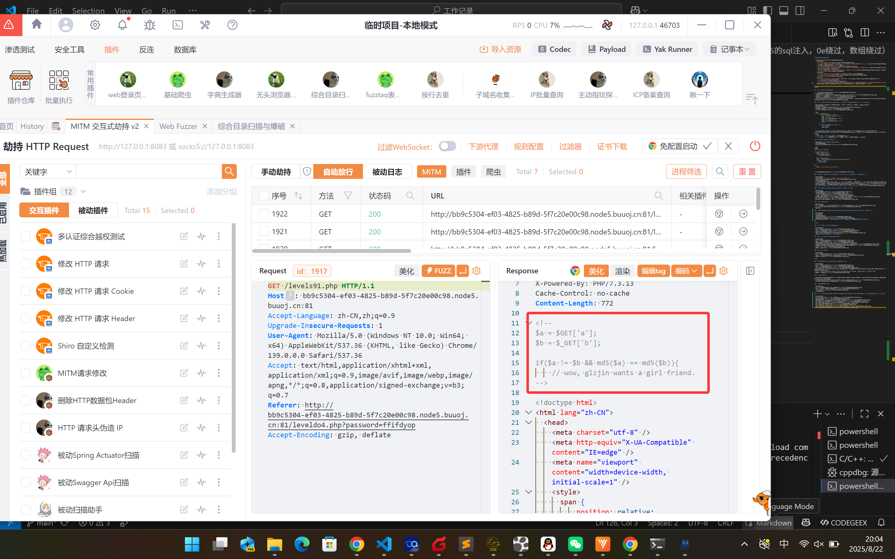
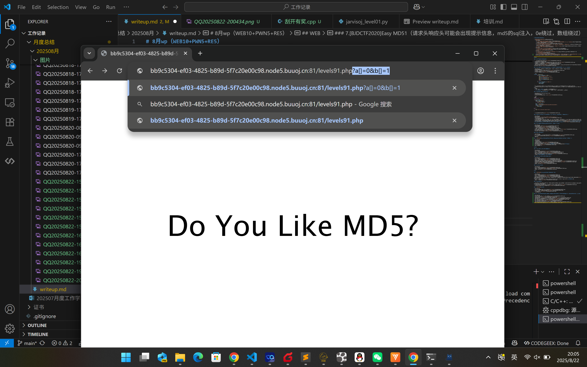
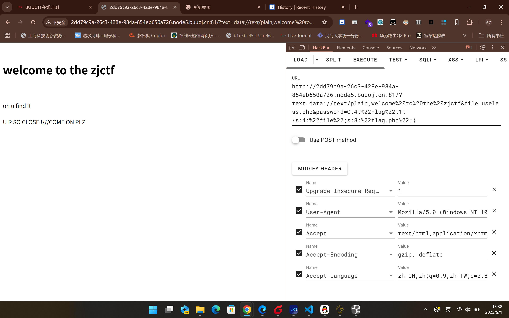
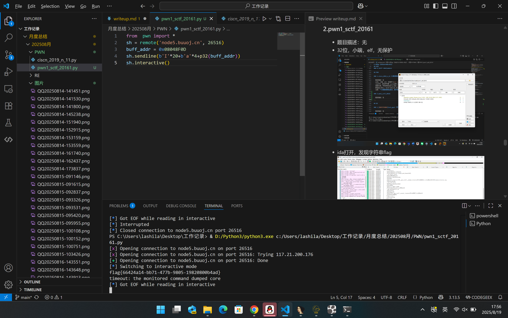
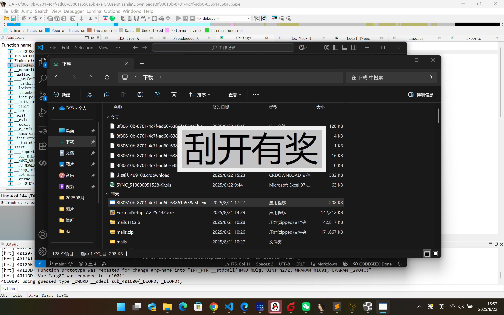
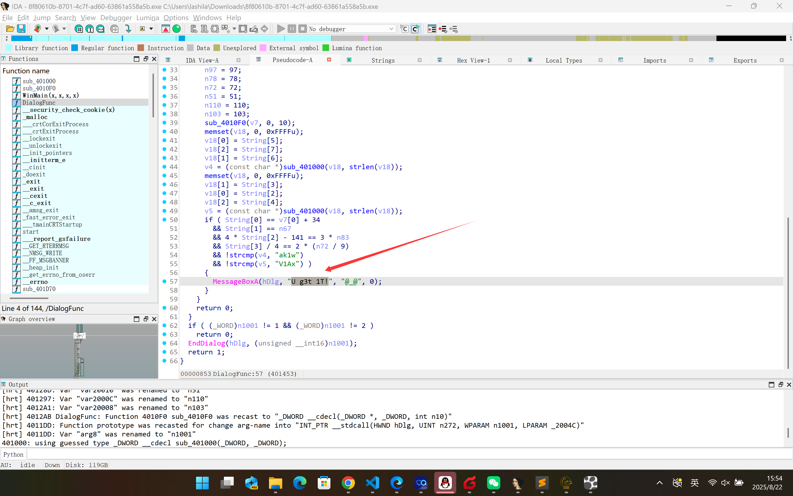

# 8月wp（WEB10+PWN5+RE5）

- [8月wp（WEB10+PWN5+RE5）](#8月wpweb10pwn5re5)
  - [WEB](#web)
    - [1.\[极客大挑战 2019\]BabySQL1](#1极客大挑战-2019babysql1)
    - [2.\[极客大挑战 2019\]PHP1（对php代码不熟悉，不知道反序列化要%00代表空格，和绕过wakeup）](#2极客大挑战-2019php1对php代码不熟悉不知道反序列化要00代表空格和绕过wakeup)
    - [3.\[ACTF2020 新生赛\]BackupFile1](#3actf2020-新生赛backupfile1)
    - [4.\[RoarCTF 2019\]Easy Calc1（不知道空格绕过waf，不熟悉php语句要添加分号才能运行）](#4roarctf-2019easy-calc1不知道空格绕过waf不熟悉php语句要添加分号才能运行)
    - [5.\[极客大挑战 2019\]BuyFlag1（修改Cookie值和数组绕过strcmp）](#5极客大挑战-2019buyflag1修改cookie值和数组绕过strcmp)
    - [6.\[HCTF 2018\]admin1](#6hctf-2018admin1)
    - [7.\[BJDCTF2020\]Easy MD51（请求头响应头可能会出现提示信息，md5的sql注入，0e绕过，数组绕过）](#7bjdctf2020easy-md51请求头响应头可能会出现提示信息md5的sql注入0e绕过数组绕过)
    - [8.你传你🐎呢1](#8你传你呢1)
    - [9.\[护网杯 2018\]easy\_tornado1（tornado是python框架，通过ssti注入handler.settings可获得环境变量）](#9护网杯-2018easy_tornado1tornado是python框架通过ssti注入handlersettings可获得环境变量)
    - [10.\[ZJCTF 2019\]NiZhuanSiWei1（php伪协议,数据封装流data://text/plain，base64编码php://filter/convert.base64-encode/resource=./useless.php）](#10zjctf-2019nizhuansiwei1php伪协议数据封装流datatextplainbase64编码phpfilterconvertbase64-encoderesourceuselessphp)
  - [PWN](#pwn)
    - [1.ciscn\_2019\_n\_11（小数用地址表示）](#1ciscn_2019_n_11小数用地址表示)
    - [2.pwn1\_sctf\_20161(函数返回地址是ebp+4)](#2pwn1_sctf_20161函数返回地址是ebp4)
    - [3.jarvisoj\_level01](#3jarvisoj_level01)
    - [4.\[第五空间2019 决赛\]PWN51（格式化输出printf添加%，可以把对应地址写到栈上，再去栈上的地址修改对应值）](#4第五空间2019-决赛pwn51格式化输出printf添加可以把对应地址写到栈上再去栈上的地址修改对应值)
    - [5.jarvisoj\_level21](#5jarvisoj_level21)
  - [RE](#re)
    - [1.\[GXYCTF2019\]luck\_guy1（字符串小端存储要倒过来）](#1gxyctf2019luck_guy1字符串小端存储要倒过来)
    - [2.Java逆向解密1](#2java逆向解密1)
    - [3.\[BJDCTF2020\]JustRE1](#3bjdctf2020justre1)
    - [4.刮开有奖1（这道题学到了看不懂的反编译代码，可以直接C运行，另外，这道题靠自己猜出了base64编码，还是挺牛逼的）](#4刮开有奖1这道题学到了看不懂的反编译代码可以直接c运行另外这道题靠自己猜出了base64编码还是挺牛逼的)


## WEB

### 1.[极客大挑战 2019]BabySQL1

- 第一次尝试万能密码，失败！
- 尝试sqlmap，未能识别到注入点
- 尝试报错注入，出现错误回显，注意到万能密码中的or被替换为null
- 尝试对or进行双写，成功绕过
- 尝试联合注入，成功回显
- 爆表 information_schema.tables -> information_schema.columns -> group_concat(passwoorrd)+frfromom+b4bsql+whewherer+username='flag'

### 2.[极客大挑战 2019]PHP1（对php代码不熟悉，不知道反序列化要%00代表空格，和绕过wakeup）

- 题目描述：因为每次猫猫都在我键盘上乱跳，所以我有一个良好的备份网站的习惯不愧是我！！！
- F12没发现别的提示
- 根据提示开始扫目录，发现存在压缩包
- down下来发现源码
- 其中存在反序列化利用点

```php
function __destruct(){
        if ($this->password != 100) {
            echo "</br>NO!!!hacker!!!</br>";
            echo "You name is: ";
            echo $this->username;echo "</br>";
            echo "You password is: ";
            echo $this->password;echo "</br>";
            die();
        }
        if ($this->username === 'admin') {
            global $flag;
            echo $flag;
```

- 构造payload，O:4:"Name":2:{s:14:"Nameusername";s:5:"admin";s:14:"Namepassword";s:3:"100";}，还是不行
- 百度以后，修改payload为O:4:"Name":3:{s:14:"%00Name%00username";s:5:"admin";s:14:"%00Name%00password";s:3:"100";}，得到flag
- 注意：
  1. 将空格变为 **%00** 若果不写在复制的时候就会减少空格
  2. **__wakeup**  在反序列化时，当前属性个数大于实际属性个数时，就会跳过__wakeup()

### 3.[ACTF2020 新生赛]BackupFile1

- 题目描述：Try to find out source file!
- F12没发现别的提示
- dirsearch扫描发现存在源码备份

```php
<?php
include_once "flag.php";

if(isset($_GET['key'])) {
    $key = $_GET['key'];
    if(!is_numeric($key)) {
        exit("Just num!");
    }
    $key = intval($key);
    $str = "123ffwsfwefwf24r2f32ir23jrw923rskfjwtsw54w3";
    if($key == $str) {
        echo $flag;
    }
}
else {
    echo "Try to find out source file!";
}
```

- 利用php的弱比较获得flag

### 4.[RoarCTF 2019]Easy Calc1（不知道空格绕过waf，不熟悉php语句要添加分号才能运行）

- 题目描述：无
- F12显示WAF，`<!--I've set up WAF to ensure security.-->`
- 输入1/0，抓包到路径calc.php
- 多次尝试均无法绕过waf
- 经百度搜索，当服务器只对 num 参数做检测，而对于其他参数不做检测时，可以通过空格绕过的方式绕过waf，即传入参数“ num”
- 经测试，网页可以传入eval()，但同时对echo和print做了屏蔽，仅能返回phpinfo()。
- 本来测了php代码，一直未成功，最后查了百度发现，原因是语句结尾没加';'，因此最后payload是**空格num=var_dump(scandir(chr(46)));->file_get_contents(chr(47).chr(102).chr(49).chr(97).chr(103).chr(103));**

### 5.[极客大挑战 2019]BuyFlag1（修改Cookie值和数组绕过strcmp）

- 题目描述：无
- F12找到页面pay.php，
- 发现提示词flag
- 继续F12，发现password
- 多次构造发包，无有效回显
- 经查询，需更改Cookie值为1，对应学生身份，有点偏实际，脑子没转过来
- 构造后，输出数字太长
- 采用科学计数法，或数组绕过比较

### 6.[HCTF 2018]admin1

- 题目描述：无
- 据观察，网站有注册，登录，发帖，修改，登出，修改密码等功能
- 注册有验证，登录没有，可以尝试爆破
- 得到flag

### 7.[BJDCTF2020]Easy MD51（请求头响应头可能会出现提示信息，md5的sql注入，0e绕过，数组绕过）

- 题目描述：无
- F12，无发现
- 尝试输入，无回显
- 尝试md5爆破，无回显
- 这时发现响应头有提示信息
- 均查询这个地方可以构造一个ascii码含有**or‘数字**的md5值，直接得到payload=**ffifdyop**
- 跳转后发现提示
- 0e绕过或数组绕过，
- 跳转，继续数组绕过，得到flag

### 8.你传你🐎呢1

- 题目描述：无
- F12，无发现
- 尝试上传均失败，甚至示例图片都失败
- 均查询，网站限制了上传大小和上传类型，大小应该只有10kb
- 上传成功
- 上传.htaccess文件，上传成功，且可看见右边jpg被解析为了php
- webshell连接成功
- 获得flag

### 9.[护网杯 2018]easy_tornado1（tornado是python框架，通过ssti注入handler.settings可获得环境变量）

- 题目描述：无
- 发现hints页面，里面提到了hash的生成算法
- 尝试爆破均失败
- 均查询，题目中的tornado是python的一个框架，多用于高并发，应该考虑ssti注入
- 将请求中的hash值删掉后，出现msg参数
- msg参数可以修改，判断为注入点
- 均查询，可以通过handler.settings直接获得环境变量
- 验证secret正确
- 按算法加密得到flag


### 10.[ZJCTF 2019]NiZhuanSiWei1（php伪协议,数据封装流data://text/plain，base64编码php://filter/convert.base64-encode/resource=./useless.php）

- 题目描述：无
- 打开网页，发现源代码提示
- 有flag.php
- 分析以后发现，要满足三个需求text内容包含welcome to the zjctf，file要展示useless.php，password要执行反序列化，所以要构造序列化数据
- 第一个可以用php伪协议封装数据流text=data://text/plain,welcome%20to%20the%20zjctf
- 第二个直接包含无有效显示，考虑base64编码后包含
- file=php://filter/convert.base64-encode/resource=./useless.php
- base64解码后，发现tostring方法，和上面的echo password对应
- 因此直接构造payload password=O:4:"Flag":1:{s:4:"file";s:8:"flag.php";}
- f12找到flag

## PWN

### 1.ciscn_2019_n_11（小数用地址表示）

- 题目描述：无
- 64位，小端，elf，无保护
- ida打开，发现字符串 system和flag
- 查看引用，字符串存在在func里
- 即溢出v1到v2，0x30-0x05=44,至此完成payload
- 注意：**小数要用地址表示，而不是直接输入**

### 2.pwn1_sctf_20161(函数返回地址是ebp+4)

- 题目描述：无
- 32位，小端，elf，无保护
- ida打开，发现字符串flag
- 查询到字符串在函数get_flag中
- 那就是要调用到get_flag函数，因此需要覆盖返回地址为get_flag的地址
- 分析代码，fget无法覆盖esp，但猜测下面代码功能应该是将I替换成you
- 验证猜测
- 因此构造payload

### 3.jarvisoj_level01

- 题目描述：无
- 64位，小端，elf，无保护
- ida打开，发现字符串bin/bash和函数system
- 因此构造payload

### 4.[第五空间2019 决赛]PWN51（格式化输出printf添加%，可以把对应地址写到栈上，再去栈上的地址修改对应值）

- 题目描述：无
- 32位，小端，elf，cannary保护（无溢出）
- ida打开，发现字符串bin/bash
- 查询知识点习得：
  - %d：用于读取或输出十进制整数
  - ％x：用于读取或输出十六进制整数
  - ％p：用于输出指针的值（通常以十六进制形式显示）
  - （％x、％p）：可以用来获取对应栈上存储的十六进制数值，查看自己输入的值的存放位置，后者可以不用考虑位数区别】
  - ％s：用于读取或输出字符串（可以用来获取对应栈的内容，注意有零截断，即如果栈上的字符串中间包含 '\0'，输出会在该位置截断）
  - ％n：不会输出任何内容，而是将到目前为止已经输出的字符数量写入到对应的整数指针参数所指向的内存位置（用于读取前面字符串的长度并写入某个内存地址）
  - （用了这个格式化说明符后就已经把原来的内容修改为字符数量了，
  - 因此在这题的格式化字符串漏洞中我们输入的密码就是字符数量——把原来从文件里抽取的那个随机数（已经存放到地址里的）改了，因此我们只要输入字符数量就可以满足下面的if语句）【在利用格式化字符串漏洞时，攻击者可以利用 %n 来修改栈上的内存内容，例如修改返回地址，从而实现任意代码执行】
  - %a$b：表示对栈上第 n 个参数进行 x 对应的格式化操作【a 是一个整数，表示栈上参数的位置索引（从 1 开始计数），b是其他的格式化说明符（如x、s、d 等）可以对栈上第n个参数进行相应占位符的操作】
- 现在需要确定read和printf之间栈上又偏移了多少，才能将值写入特定地址
- 可以看到栈上第10个值
- 因此构造payload，得到flag

### 5.jarvisoj_level21

- 题目描述：无
- 32位，小端，elf，无保护
- ida打开，发现read函数存在缓冲区溢出，左边函数列表存在system
- 字符串存在bin/bash
- 根据字符串大小构造payload
- 得到flag

## RE

### 1.[GXYCTF2019]luck_guy1（字符串小端存储要倒过来）

- 题目描述：无
- 64位，小端，elf，无保护
- ida打开，发现字符串flag
- 查看引用，发现字符串就在main中
- 跟进函数main()->patch_me()->get_flag(),发现代码逻辑是随机生成数字，当%200==1时返回flag，且发现反调试函数。
- 猜测执行顺序是4->5->1，其中flag = f1+f2'，f1="GXY.{do_not_"，f2=s= 'icgu`of\x7F'(**小端存储**)。
- 因此构造flag如下

### 2.Java逆向解密1

- 题目描述：程序员小张不小心弄丢了加密文件用的秘钥，已知还好小张曾经编写了一个秘钥验证算法，聪明的你能帮小张找到秘钥吗？ 注意：得到的 flag 请包上 flag{} 提交
- 根据题目描述，下载文件，发现是java文件，用jd-gui反编译，发现算法
- 根据源码，编写python脚本，得到flag

### 3.[BJDCTF2020]JustRE1

- 题目描述：无
- 32位，有保护但没看懂，百度也查询不到
- ida打开，发现一个很奇怪的字符串
- 标准字符串输出
- 替换后得到flag

### 4.刮开有奖1（这道题学到了看不懂的反编译代码，可以直接C运行，另外，这道题靠自己猜出了base64编码，还是挺牛逼的）

- 题目描述：无
- 32位，无保护，ida打开，什么也没发现
- 该文件也无法运行
- ida硬跟，发现一个看上去像get的字符串，跟着分析代码
- 发现函数把三个字符变成了4个，猜测是base64编码，
- 点进函数，发现每次读6位，基本确认是base64编码
- 现在只剩下处理int列表的函数，
- 点进函数发现递归，推不出来
- 查询百度后发现，可以直接C写出来看输出，得到真实列表
- 根据反编译解密密文，得到flag